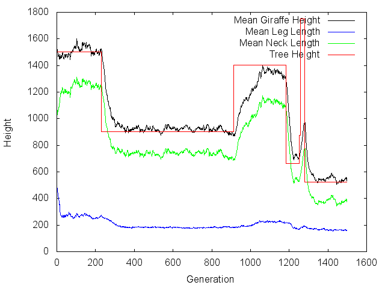

Genetic algorithm project simulating an animal's phenotypic response to
a changing environment.

The selective pressures in the environment include:

1) trees that grow at particular heights

2) lions that run at particular speeds

3) an environment of a particular color

In this simulation, "Giraffes" are provided several "chromosomes"
whose genes collectively dictate leg length, neck length, and fur color.

These genes are exposed to selective pressure. Fur color's selection is modeled
with ability to camoflage, but leg length and neck length are not directly selected
for. Rather:

1) giraffes must outrun lions, and their running speed is dictated by their leg length

2) giraffes must eat, and their ability to forage is based on their total height

A generation model pushes the population towards optimal genetic structure using
fitness-weighted reproductive rules, mutation, and randomized inheritance
of parents' genes.

At random intervals the environment's global tree height changes, and we can
watch phenotypic response in our population:

Example:

This program also exposes a cli command to plot the fitness landscape
of leg length vs neck length in three dimensions with either static png
gnuplot rendering, or kiss3d interactable renderings.

Example:

